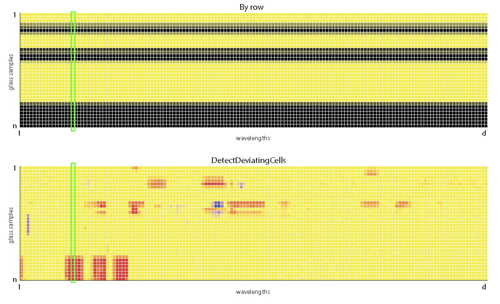
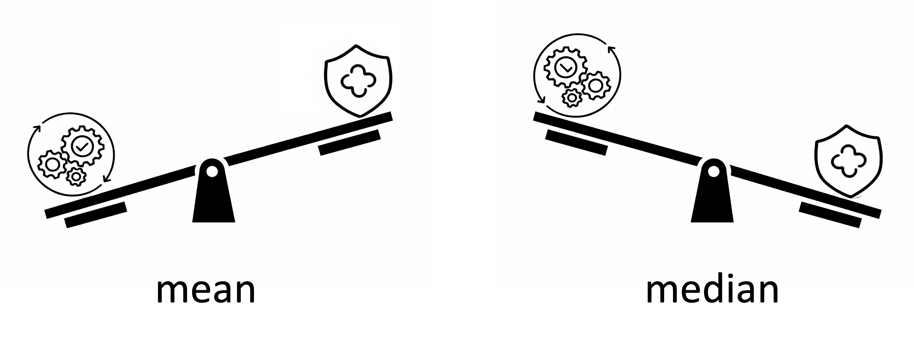
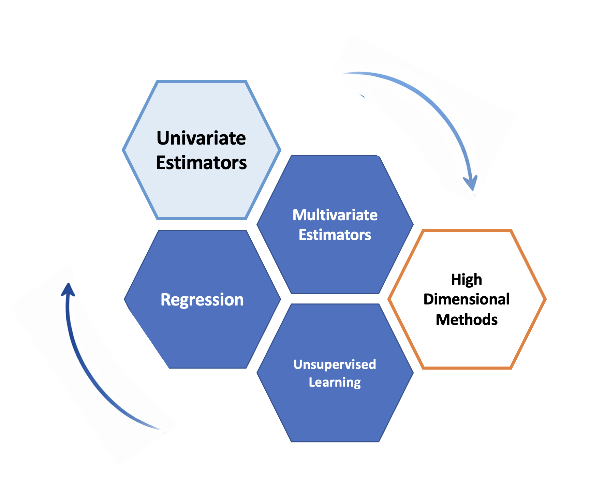
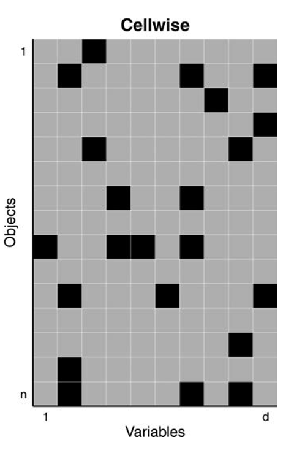
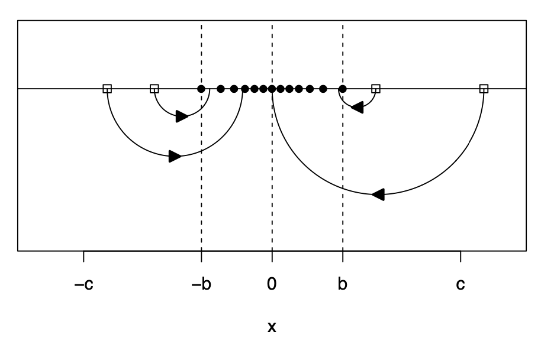

## Attribution

<br>

-   Some examples and references are from [*Challenges of cellwise outliers*, by Raymaekers and Rousseeuw](https://www.sciencedirect.com/science/article/pii/S2452306224000078)

-   [*Robust Statistics*, by Maronna, Martin, Yohai, Salibian-Barrera](https://onlinelibrary.wiley.com/doi/book/10.1002/9781119214656)

<br>

*In memory of my mentor and friend*

Professor Ruben Zamar (1949-2023)

who contributed greatly to Robust Statistics and beyond ...

<br><br>

## Review {.scrollable}

-   An **outlier** is an observation that deviates from the bulk of the data, an atypical observation.

-   We defined both casewise and cellwise outliers but focused on **univarite outliers**.

 We defined and examined by simulations three univariate estimators of location: the **mean**, the **median**, the **M-estimators**.

-   We learned about the trade-off between robustness and efficiency.

## 

::: {.callout-note title="Definition: Efficiency"}
Efficiency measures how precise an estimator is, the more efficient the estimator, the less it varies across samples.
:::

-   **Relative efficiency** compares two unbiased estimators by the ratio of their variances.

-   Since the **sample mean** is an optimal estimator (MLE) under the Normal distribution, we measured the **efficiency** of robust estimators in comparison to the sample mean, for example:

<br>

::::: columns
::: {.column width="50%"}
$$\frac{\text{Var}(\text{sample median})}{\text{Var}(\text{sample mean})}$$
:::

::: {.column width="50%"}
{width="400"}
:::
:::::

## From one variable to an entire dataset

::::: columns
::: {.column width="70%"}

:::
::: {.column width="30%"}

Three core tasks: 

- **Estimating multivariate paramters** (e.g, location and covariance)

- **Modeling relationships** (e.g., regression)

- **Discovering structure** (e.g., unsupervised learning)

:::
:::

### Goal for today

- 1. What is a multivariate parameter?
- 2. How do we estimate multivariate location and scatter robustly?
- 3. How do we detect multivariate outliers?
- 4. Why do cellwise outliers need different tools?

## From one variable to many variables

<br>

For one variable, typical parameters are:

- **center**: mean, median
- **spread**: variance, SD, MAD

<br>

With several variables, we also estimate:

- **multivariate center**: e.g., vector of means or medians

- **multivariate scatter**: e.g., the sample covariance matrix

- **association**: a matix of pairwise correlations

## Correlation matrix

```{r echo = FALSE}
#| label: corr-heatmap
#| fig-format: png

library(cellWise)
library(dplyr)
library(ggplot2)
library(tidyr)
library(robustbase)
library(GGally)
library(rlang)

#install.packages("RobStatTM")
library(RobStatTM)

data(data_glass)

glass_df <- as.data.frame(data_glass)


cor_mat <- cor(glass_df, use = "pairwise.complete.obs")

cor_long <- as.data.frame(cor_mat) |>
  tibble::rownames_to_column("Var1") |>
  pivot_longer(-Var1, names_to = "Var2", values_to = "cor")

cor_heatmap <- ggplot(cor_long, aes(Var1, Var2, fill = cor)) +
  geom_tile() +
  coord_equal() +
  scale_y_discrete(limits = rev) +
  scale_fill_gradient2(limits = c(-1, 1)) +
  theme_minimal(base_size = 11) +
  theme(
    axis.text = element_blank(),
    axis.ticks = element_blank(),
    axis.title = element_blank()
  ) 

cor_heatmap 
```

- Each entry measures pairwise linear association between variables
- Diagonal entries are 1

## Multivariate estimators in R

Let's start by visualizing pair-wise estimates for 4 variables

```{r echo = FALSE}
X <- glass_df[,28:31]   

# helper function
panel_mean <- function(data, mapping, ...) {
  xvar <- as_name(mapping$x)
  yvar <- as_name(mapping$y)

ggplot(data = data, mapping = mapping) +
    geom_point(color = "grey70", size = 1.5) +
    geom_point(
      x = mean(data[[xvar]]),
      y = mean(data[[yvar]]),
      color = "red", shape = 4, size = 4, stroke = 1.2
    )
}

# ggpairs with means
ggpairs(
  X,
  lower = list(continuous = panel_mean),
  diag  = list(continuous = "densityDiag"),
  upper = list(continuous = wrap("cor", size = 4))
)
```

- Distribution of each variable in the diagonal
- Pairwise scatter plots and correlations off-diagonal
- Pairwise sample means shown as red crosses

# Rowwise outliers

##

```{r echo = FALSE}
X <- glass_df[,c(29:31,169)]
           
# helper function
panel_mean <- function(data, mapping, ...) {
  xvar <- as_name(mapping$x)
  yvar <- as_name(mapping$y)

ggplot(data = data, mapping = mapping) +
    geom_point(color = "grey70", size = 1.5) +
    geom_point(
      x = mean(data[[xvar]]),
      y = mean(data[[yvar]]),
      color = "red", shape = 4, size = 4, stroke = 1.2
    )
}

# ggpairs with means
ggpairs(
  X,
  lower = list(continuous = panel_mean),
  diag  = list(continuous = "densityDiag"),
  upper = list(continuous = wrap("cor", size = 4))
)
```

#### Outliers are visible in the (marginal) distribution of V169, so it is not surprising that they affect pairwise summaries too.

## Multivariate outliers

```{r echo = FALSE}
X <- glass_df[,c(29:30,61:62)]
           
# helper function
panel_mean <- function(data, mapping, ...) {
  xvar <- as_name(mapping$x)
  yvar <- as_name(mapping$y)

ggplot(data = data, mapping = mapping) +
    geom_point(color = "grey70", size = 1.5) +
    geom_point(
      x = mean(data[[xvar]]),
      y = mean(data[[yvar]]),
      color = "red", shape = 4, size = 4, stroke = 1.2
    )
}

# ggpairs with means
ggpairs(
  X,
  lower = list(continuous = panel_mean),
  diag  = list(continuous = "densityDiag"),
  upper = list(continuous = wrap("cor", size = 4))
)
```

#### Some observations deviate from the overall trend, while others reinforce it.

## Robust multivariate estimators

- **M-estimators** have also been proposed for the multivariate case.

- Estimators based on the idea of trimming observations are also widely used, for example the **Minimum Covariance Determinant (MCD)**.

  - Among many possible groups of $h$ observations, choose the one that forms the tightest cluster of points

  - Compute the center and the spread using only that group

::: columns

::: {.column width="35%"}
<br>

MCD tries to estimate the bulk of the data, rather than being influenced by extreme observations.
:::
::: {.column width="65%"}

```{r echo=FALSE}
df <- X[, 2:3]

mcd <- covMcd(df)
md <- mahalanobis(df, mcd$center, mcd$cov)
cut <- qchisq(0.9, 2)

ggplot(df, aes(V30, V61)) +
  geom_point(color="grey60") +
  stat_ellipse(
    type="norm",
    level=0.9,
    segments=200,
    color="blue"
  ) +
  annotate("point",
           x=mcd$center[1],
           y=mcd$center[2],
           color="red",
           size=4)

```
:::
:::

## Detecting outliers

When looking at each variable at a time, we used the 3-$\sigma$ rule:

$$
|z_i| = \left|\frac{x_i - \hat{\mu}}{\hat{\sigma}}\right| > 3
$$

With several variables, the analogue is the **Mahalanobis distance**:

$$
MD(\mathbf{x}_i) = \sqrt{(\mathbf{x}_i - \hat{\mathbf{\mu}})^T \hat{\Sigma}^{-1} (\mathbf{x}_i - \hat{\mu})} > \text{cut-off}
$$

- It measures the distance of each point $\mathbf{x}_i$ to the center $\hat{\mathbf{\mu}}$, taking the correlation between variables into account. 

- Using robust estimates $\hat{\mu}$ and $\hat{\Sigma}$, we can control masking and define a score to detect outliers.

> recall replacing mean/SD by median/MAD in the univariate case

## 

```{r}
#MCD estimator
mcd <- covMcd(X)
md <- mahalanobis(X, mcd$center, mcd$cov)
cutoff <- qchisq(0.975, ncol(X))

md_df <- data.frame(
  obs = seq_along(md),
  RD2 = md,
  flag = md > cutoff)
```

```{r echo=FALSE}
ggplot(md_df, aes(x = obs, y = RD2)) +
  geom_point(aes(shape = flag, color = flag), size = 2) +
  scale_shape_manual(values = c(16, 17)) +
  scale_color_manual(values = c("black", "blue")) +
  geom_hline(yintercept = cutoff, linetype = "dashed")
```

#### Points (rows) with a squared MD exceeding the cutoff are flagged as rowwise outliers

## Other estimators

```{r}
# MM-estimator
mm_multivariate <- covRob(X)
mm_multivariate$cov
head(mm_multivariate$dist)
```

```{r echo=FALSE}

# Classical estimators
mean_est <- colMeans(X)
median_est <- apply(X, 2, median)

# Robust estimators
mcd_est <- mcd$center
mm_est <- mm_multivariate$mu

# Combine into table
center_table <- rbind(
  Mean = mean_est,
  Median = median_est,
  MCD = mcd_est,
  MM = mm_est
)

knitr::kable(round(center_table,3))
```

# Cellwise outliers

## 

::: columns

::: {.column width="55%"}
<br>

### But what if only a few cells are contaminated in many rows?

- every row may contain at least one bad entry
- rowwise methods can lose too much information
- we need methods that work more **coordinatewise**

#### This motivates wrapping and DDC.

:::
::: {.column width="45%"}

:::
:::

## DDC: Detect Deviating Cells

DDC is aimed at **cellwise** outliers.

- use the relationships among variables
- predict what a cell should look like from the others
- flag cells that deviate strongly from that prediction

#### DDC looks for suspicious **entries**, not just suspicious rows.

- DDC uses robust correlations to describe relationships among variables

- DDC can also detect missing or implausible values

- flagged cells can be imputed using predictions from other variables

#### In high-dimensional data, contamination often occurs cell by cell, not row by row.


## Robust correlation by wrapping {.scrollable}

In the spirit of Huber's estimation, wrapping have been proposed to compute robust correlations (fast): 

<br>

::: columns

::: {.column width="55%"}


- 1. robustly standardize each variable

- 2. transform extreme values with a bounded function

- 3. compute ordinary correlations on the transformed data

:::
::: {.column width="45%"}




:::
:::


So we keep the speed and matrix structure of classical correlation, but gain robustness.

<br>

::: {style="font-size: 13px; margin-top: -30px; color: grey;"}

from Raymaekers, J., and Rousseeuw, P.J, (Technometrics 2021)
:::

##

```{r}
#uses wrapping to estimate correlations
fastDDCpars=list(fastDDC=T,silent=F)

#computes DDC algorithm
fastDDCglass =  DDC(X,fastDDCpars)

#removes variables without variation
glass_clean = fastDDCglass$remX; dim(fastDDCglass$remX)

nrowsinblock <- 5
ggpfastDDC <- cellMap(
  D = glass_clean,
  R = fastDDCglass$stdResid,
  indcells = fastDDCglass$indcells,
  indrows = fastDDCglass$indrows,
  mTitle = "Cellwise Outlier Detection",
  nrowsinblock = nrowsinblock,
  columnangle = 90,
  sizetitles = 1.5,
  autolabel = FALSE
)
```

##

```{r}
plot(ggpfastDDC)
```

## Key Takeaways

<br>

-   In both univariate and multivariate cases, classical estimators are highly sensitive to outliers

-   Robust estimators reduce the influence of extreme observations

- **Rowwise contamination**

  - Methods such as M-estimators and MCD estimate robust multivariate center and scatter
  
  - These estimates can be used to compute robust Mahalanobis distances to detect outliers

##

- **Cellwise contamination**

  - Methods such as DDC and wrapping detect corrupted cells 
  - They rely on relationships among variables and are used to compute robust multivariate estimates and flag outliers

- Robust methods improve both estimation and outlier detection

**Beyond Multivariate estimation**

- Similar ideas have been used to propose robust regression methods
  - e.g., minimizing a robust function of the residuals instead of the sum of squares

- Multivariate estimators are essential in unsupervised methods
  - e.g., principal component analysis (PCA)
